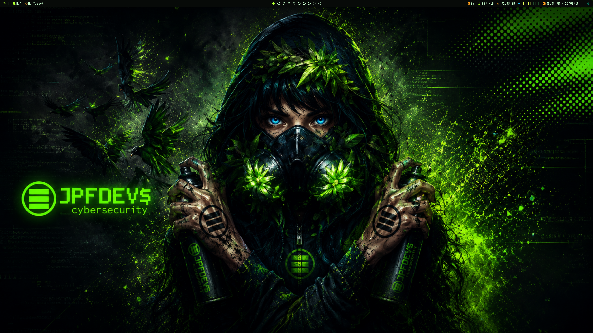
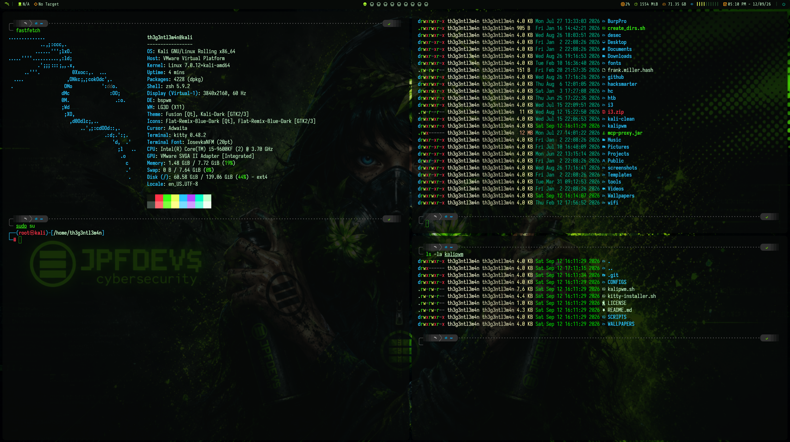

# KaliPWM

Deploy a professional hacking environment for Kali Linux by running just one script.




## Installation and usage

- A fresh/clean install of Kali Linux is recommended.
- Tested on Kali Linux 2025.1 with VMware, VirtualBox, and bare metal.

```
git clone https://github.com/afsh4ck/kalipwm.git
cd kalipwm
bash kalipwm.sh
sudo reboot
```
- Once rebooted, switch to bspwm on the login screen.
- The wallpaper is taken from ~/Wallpapers/wallpaper.*
- Full video walkthrough of the environment: https://youtu.be/3clLjO8W7Q4?si=GupOi6Bqwuu2O9Wk

## Commands

> [!NOTE]
> On macOS, replace Windows with Command, and Alt with Option.

| Command                     | Description                                                  |
|------------------------------|---------------------------------------------------------------|
| Right-click on Polybar       | Change the Polybar theme using the right-click menu          |
| Windows + 1,2,3,4            | Navigate between desktops                                     |
| Windows + Enter              | Open a new terminal                                           |
| Windows + Enter              | Split the current terminal                                    |
| Windows + Arrows             | Navigate between open windows                                 |
| Windows + Tab                | Switch between the two most recent desktops                   |
| Windows + Shift + W          | Close the current terminal                                    |
| Windows + Alt + R            | Reload the desktop environment                                |
| Windows + Alt + Q            | Restart BSPWM                                                  |
| Windows + Alt + Arrows       | Resize the current window                                     |
| Windows + Shift + F          | Open Firefox                                                   |
| Windows + Shift + B          | Open Burp Suite                                                |
| Windows + Shift + A          | Open the Thunar file manager                                   |
| Windows + Shift + 1,2,3,4    | Move the current window to another desktop                    |
| Windows + Shift + Arrows     | Move the current window                                        |
| Ctrl + Shift + -+            | Change the terminal text size                                  |
| Ctrl + T                     | Open an advanced search from the terminal                      |
| .config/sxhkd/sxhkdrc        | Shortcut configuration file (sxhkd)                            |
| .config/bspwm/bspwmrc        | BSPWM configuration file                                        |
| .config/polybar              | Folder with Polybar themes                                      |
| .config/kitty/kitty.conf     | Default configuration file for the Kitty terminal              |
| ~/Wallpapers                 | Wallpapers folder. Only one file named wallpaper.jpg is allowed  |
| target 10.0.0.1              | Selects a target IP, which is shown in Polybar                 |
| target reset                 | Removes the selected target                                    |
| tmux                         | Switch the terminal to tmux                                     |
| tmux --help                  | Show tmux help                                                  |
| p10k configure                | Configure the Powerlevel10k terminal theme                     |
| .zshrc                        | ZSH configuration file and command aliases                      |
| bpython                       | Interactive Python in the terminal                              |

## Included packages:

```
Bspwm
Polybar
Oh my zsh + Plugins
Powerlevel10k
Hack Nerd Fonts
JetBrains Font
Python + pip + bpython
Tmux + Oh my tmux
Kitty
lsd
Batcat
Fastfetch
Scrot
feh
Rofi
Sxhkd
Picom
Neovim
```

## Credits
- Author:      afsh4ck
- Instagram:   <a href="https://www.instagram.com/afsh4ck">afsh4ck</a>
- YouTube:     <a href="https://youtube.com/@afsh4ck">afsh4ck</a>

## Support

<a href="https://www.buymeacoffee.com/afsh4ck" rel="nofollow">

</a>
